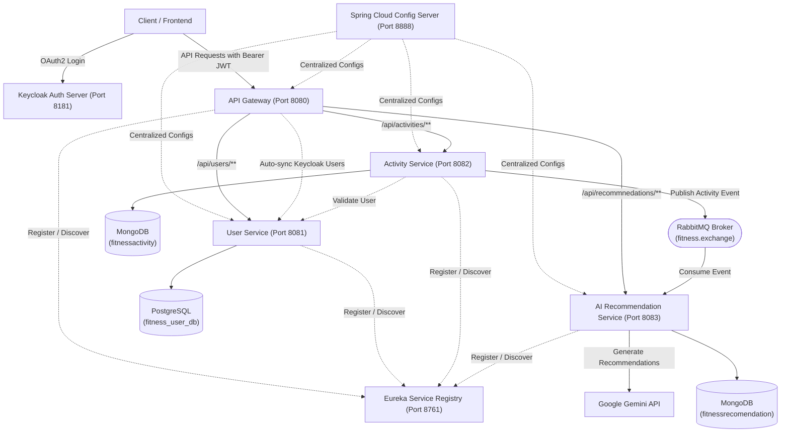

# 🏋️ AI-Powered Fitness Tracking Microservices Platform

[](https://openjdk.org/)
[](https://spring.io/projects/spring-boot)
[](https://spring.io/projects/spring-cloud)
[](https://www.rabbitmq.com/)
[](https://www.postgresql.org/)
[](https://www.mongodb.com/)
[](https://www.keycloak.org/)
[](https://ai.google.dev/)

An enterprise-ready, event-driven fitness tracking ecosystem built with **Spring Boot Microservices**, **Spring Cloud**, **RabbitMQ**, **Polyglot Persistence**, and **Google Gemini AI**.

---

## 📑 Table of Contents
- [Architecture Overview](#-architecture-overview)
- [Microservices Breakdown](#-microservices-breakdown)
- [Key Features](#-key-features)
- [Tech Stack](#-tech-stack)
- [API Reference](#-api-reference)
- [Environment Variables](#-environment-variables)
- [Local Setup & Startup Guide](#-local-setup--startup-guide)
- [Railway / Cloud Deployment](#-railway--cloud-deployment)

---

## 🏛 Architecture Overview



---

## 🧩 Microservices Breakdown

| Service | Port | Database / Broker | Description |
|---|---|---|---|
| **[`configserver`](fitness-app-backend/configserver)** | `8888` | Native Classpath Config | Centralized configuration server managing profiles for all services. |
| **[`eureka`](fitness-app-backend/eureka)** | `8761` | Eureka Server | Service registry for dynamic service discovery and client-side load balancing. |
| **[`gateway`](fitness-app-backend/gateway)** | `8080` | Keycloak OAuth2 JWT | Reactive API gateway handling routing, CORS, JWT security, and JIT user sync. |
| **[`userservice`](fitness-app-backend/userservice)** | `8081` | PostgreSQL (`fitness_user_db`) | Manages user profiles, role mapping, and Keycloak ID verification. |
| **[`activityservice`](fitness-app-backend/activityservice)** | `8082` | MongoDB (`fitnessactivity`) + RabbitMQ | Logs workouts (running, cycling, HIIT, yoga, etc.) and publishes async events. |
| **[`aiservice`](fitness-app-backend/aiservice)** | `8083` | MongoDB (`fitnessrecomendation`) + RabbitMQ | Asynchronously consumes activity events, queries Google Gemini AI, and saves recommendations. |

---

## ✨ Key Features

1. **Decoupled Asynchronous AI Engine**: Workout logging is instant. An asynchronous message queue (**RabbitMQ**) offloads the generation of LLM workout analyses to the AI service without blocking the user.
2. **Just-In-Time (JIT) Keycloak Sync**: `KeycloakUserSyncFilter` intercepts incoming tokens at the gateway, checks if the user exists in PostgreSQL, and registers them automatically on their first login.
3. **Polyglot Persistence**:
   * **PostgreSQL (JPA/Hibernate)**: ACID compliance and relational structure for user authentication identities.
   * **MongoDB**: High-speed, schema-flexible storage for dynamic workout metrics and rich AI recommendation payloads.
4. **Intelligent Gemini AI Recommendations**: Prompts Gemini with workout metrics (duration, calories, heart rate, pace) to generate structured feedback:
   * **Overall Analysis**
   * **Targeted Improvements**
   * **Next Workout Suggestions**
   * **Safety & Hydration Guidelines**
5. **Resilient HTTP Communication**: Load-balanced `WebClient` with exponential retry backoff on AI rate limits (`HTTP 429`, `503`, `504`) and graceful fallback recommendations.

---

## 🛠 Tech Stack

* **Backend Framework**: Spring Boot 4.1.0, Spring Cloud 2025.1.2
* **API Gateway & Reactive Stack**: Spring Cloud Gateway, Project Reactor (WebFlux)
* **Identity & Security**: Spring Security OAuth2 Resource Server, Keycloak, Nimbus JOSE+JWT
* **Databases**: PostgreSQL, MongoDB
* **Message Broker**: RabbitMQ (AMQP)
* **AI Integration**: Google Generative AI API (`gemini-flash-latest`)
* **Build System**: Apache Maven

---

## 📡 API Reference

### 👤 User Service (`/api/users`)
| Method | Endpoint | Description |
|---|---|---|
| `POST` | `/api/users/register` | Register or synchronize a user from Keycloak |
| `GET` | `/api/users/{userId}` | Get user profile by ID |
| `GET` | `/api/users/{userId}/validate` | Verify if a user exists by Keycloak ID |

### 🏃 Activity Service (`/api/activities`)
| Method | Endpoint | Description |
|---|---|---|
| `POST` | `/api/activities` | Record a new workout activity (publishes to RabbitMQ) |
| `GET` | `/api/activities` | List all activities for authenticated user (`X-User-ID`) |
| `GET` | `/api/activities/{activityId}` | Get single activity details by ID |
| `DELETE` | `/api/activities/{activityId}` | Delete an activity record |

### 🤖 AI Recommendation Service (`/api/recommnedations`)
| Method | Endpoint | Description |
|---|---|---|
| `GET` | `/api/recommnedations/user/{userId}` | Fetch all AI recommendations for a user |
| `GET` | `/api/recommnedations/activity/{activityId}` | Fetch AI recommendation for a specific activity |
| `DELETE` | `/api/recommnedations/activity/{activityId}` | Delete recommendation for an activity |

---

## 🔐 Environment Variables

| Variable | Default / Example | Purpose |
|---|---|---|
| `PORT` | `8080` (Gateway), `8081` (User), etc. | Server port for the service |
| `CONFIG_SERVER_URL` | `http://localhost:8888` | Config server location |
| `EUREKA_SERVER_URL` | `http://localhost:8761/eureka/` | Eureka registry endpoint |
| `SPRING_DATASOURCE_URL` | `jdbc:postgresql://localhost:5432/fitness_user_db` | PostgreSQL connection string |
| `SPRING_DATASOURCE_USERNAME` | `postgres` | PostgreSQL username |
| `SPRING_DATASOURCE_PASSWORD` | `your_password` | PostgreSQL password |
| `MONGODB_URI` | `mongodb://localhost:27017` | MongoDB connection URI |
| `RABBITMQ_HOST` | `localhost` | RabbitMQ broker host |
| `RABBITMQ_PORT` | `5672` | RabbitMQ broker AMQP port |
| `KEYCLOAK_JWK_SET_URI` | `http://localhost:8181/realms/fitness-oauth2/.../certs` | Keycloak OpenID certificates endpoint |
| `GEMINI_API_KEY` | `your_gemini_api_key` | Google Gemini API key |

---

## 🚀 Local Setup & Startup Guide

### Prerequisites
* **Java 21** or later
* **Maven 3.9+** (or use included `mvnw`)
* **PostgreSQL** running on port `5432`
* **MongoDB** running on port `27017`
* **RabbitMQ** running on port `5672`
* **Keycloak** running on port `8181`

### 1. Clone Repository
```bash
git clone https://github.com/Mdazam98/fitnessApp.git
cd fitnessApp/fitness-app-backend
```

### 2. Startup Order
Start the services in the following sequential order:

```bash
# 1. Config Server
cd configserver && ./mvnw spring-boot:run

# 2. Eureka Service Registry
cd eureka && ./mvnw spring-boot:run

# 3. User Service
cd userservice && ./mvnw spring-boot:run

# 4. Activity Service
cd activityservice && ./mvnw spring-boot:run

# 5. AI Service
cd aiservice && ./mvnw spring-boot:run

# 6. API Gateway
cd gateway && ./mvnw spring-boot:run
```

---

## ☁️ Railway / Cloud Deployment

To deploy all microservices to [Railway](https://railway.app):

1. **Create a Railway Project** with the following infrastructure:
   * **PostgreSQL Database**
   * **MongoDB Database**
   * **RabbitMQ** (Docker image: `rabbitmq:3-management`)
2. **Deploy Each Microservice**:
   * Add each service from the GitHub repository.
   * Set **Root Directory** to `fitness-app-backend/<service-name>` (e.g., `fitness-app-backend/gateway`).
   * Configure internal networking variables using Railway reference variables (`${{Postgres.PGHOST}}`, `${{MongoDB.MONGO_URL}}`, `rabbitmq.railway.internal`).
3. **Public Exposure**:
   * Generate a **Public Domain** only for the **API Gateway** (`gateway`).
   * Keep all other microservices private.

---

## 📄 License
This project is open-source under the [MIT License](LICENSE).
